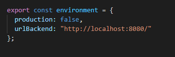
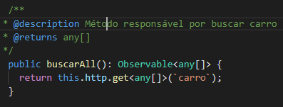
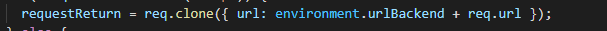

Utilizando Interceptor
=====

This is example easy use http interceptor

How to use
----------
First create a module called an interceptor and paste the following code in module:
```python

  providers: [
    {
     provide: HTTP_INTERCEPTORS,
     useClass: InterceptorService,
     multi: true,
    }
```

Second, create a service with an interceptor name: ``` ng g s interceptor/interceptor ```
Now, implements service of HttpInterceptor: ``` export class InterceptorService implements HttpInterceptor ```

Past the code:
 ```
   intercept(
    req: HttpRequest<any>,
    next: HttpHandler,
  ): Observable<HttpEvent<any>> {
    let requestReturn: HttpRequest<any>;

    if (!req.url.startsWith('http')) {
      requestReturn = req.clone({ url: environment.urlBackend + req.url });
    } else {
      requestReturn = req.clone({ url: req.url });
    }

    return next.handle(requestReturn);
  }
 ```
 
 Now, in app.module.ts, import ``` InterceptorModule ```
 
 Screenshots
----------







------------

Can you help me?
--------------
Download my games and rate them! it helps me a lot.
* https://play.google.com/store/apps/details?id=br.com.zubcov.zombiemission&hl=pt

From stars in my projects github.
* https://github.com/search?q=user%3AAlissonRichardy


--------------

References
-------------
Based of:
* https://angular.io/api/common/http/HttpInterceptor
